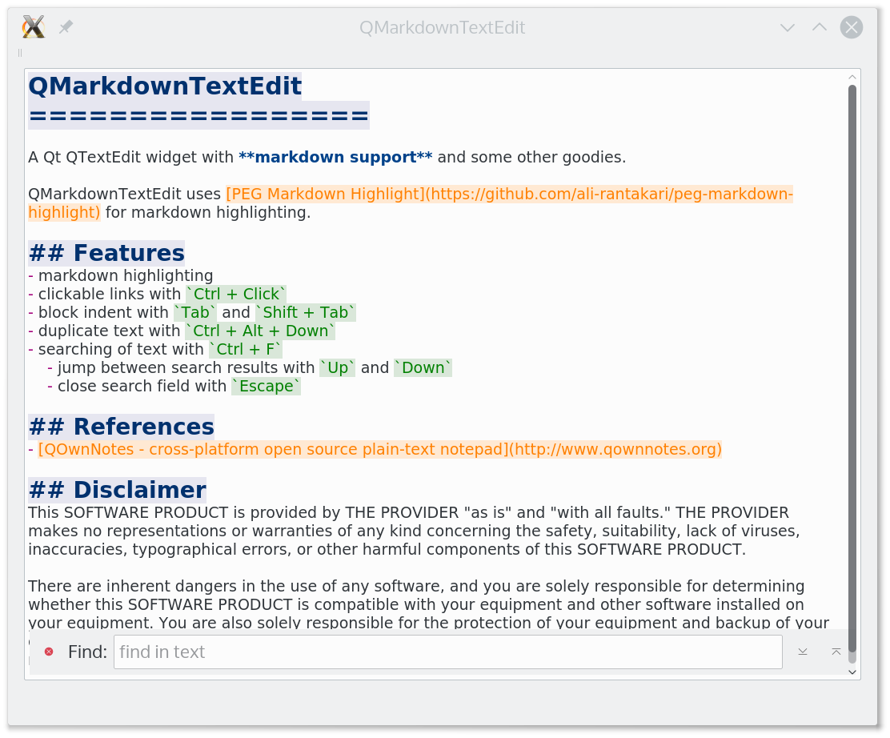

# [QMarkdownTextEdit](https://github.com/pbek/qmarkdowntextedit)

A Qt [QTextEdit](http://doc.qt.io/qt-5/qtextedit.html) widget with [markdown](https://en.wikipedia.org/wiki/Markdown) support and some other goodies.

QMarkdownTextEdit uses [PEG Markdown Highlight](https://github.com/ali-rantakari/peg-markdown-highlight) for markdown highlighting.

## Features
- markdown highlighting
- clickable links with `Ctrl + Click`
- block indent with `Tab` and `Shift + Tab`
- duplicate text with `Ctrl + Alt + Down`
- searching of text with `Ctrl + F`
    - jump between search results with `Up` and `Down`
    - close search field with `Escape`

## Screenshot

## How to use this widget
- add all `SOURCES`, `HEADERS` and `RESOURCES` from [qmarkdowntextedit.pro](https://github.com/pbek/qmarkdowntextedit/blob/develop/qmarkdowntextedit.pro) to your project
- add a normal `QTextEdit` to your UI and promote it to `QMarkdownTextEdit` (base class `QTextEdit`)

## References
- [QOwnNotes - cross-platform open source plain-text notepad](http://www.qownnotes.org)

## Disclaimer
This SOFTWARE PRODUCT is provided by THE PROVIDER "as is" and "with all faults." THE PROVIDER makes no representations or warranties of any kind concerning the safety, suitability, lack of viruses, inaccuracies, typographical errors, or other harmful components of this SOFTWARE PRODUCT. 

There are inherent dangers in the use of any software, and you are solely responsible for determining whether this SOFTWARE PRODUCT is compatible with your equipment and other software installed on your equipment. You are also solely responsible for the protection of your equipment and backup of your data, and THE PROVIDER will not be liable for any damages you may suffer in connection with using, modifying, or distributing this SOFTWARE PRODUCT.
